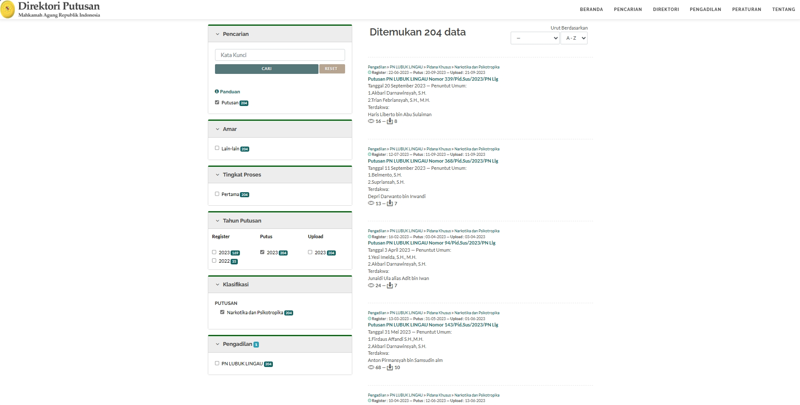
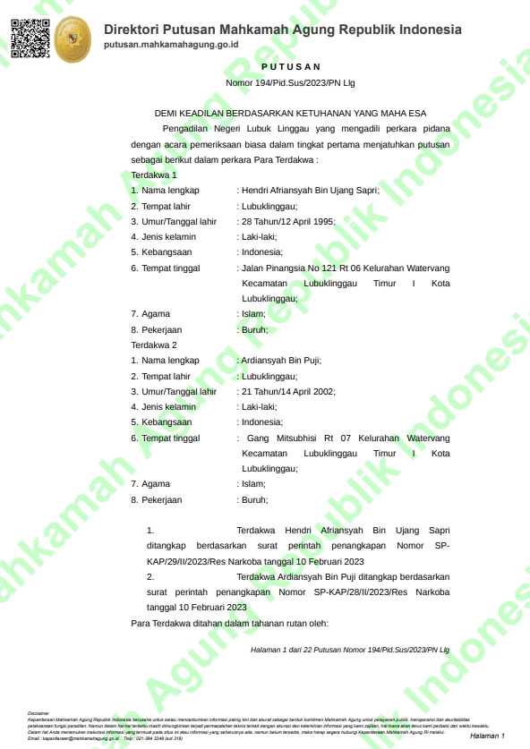

# Scraping Putusan Pengadilan Negeri Lubuk Lingau

Project ini bertujuan untuk melakukan _scraping_ data putusan Narkotika dan Psikotropika pada tahun 2023, berdasarkan Pengadilan Negeri Lubuk Lingau. Data yang diambil berupa dokumen PDF putusan yang tersedia di
**Website :**
[putusan3.mahkamahagung.go.id](putusan3.mahkamahagung.go.id)

## Hasil filter yang diterapkan

## Contoh PDF putusan

## Dataset

Struktur dari direktori berisi 2 folder `Dataset` yang berisi kumpulan pdf putusan dan `Overview` yang berisi ringkasan dari putusan yang didapatkan dalam format xlsx.

### Cara Penggunaan
- Untuk mendapatkan dataset PDF putusan, anda dapat melakukan _clone repository_ ini atau mengunduhnya sebagai zip | git clone https://github.com/fauzanadrivano/Dataset-Narkotika_312_156
- Ringkasan putusan dapat dilihat pada file `Overview.xlsx` dalam format yang lebih mudah dibaca.

## Overview

Didalam ringkasan `Overview` terdapat beberapa kolom mengenai putusan seperti Nomor Putusan, Lembaga Peradilan, Barang Bukti, dan Amar Putusan

| Nomor Putusan | Lembaga Peradilan | Barang Bukti | Amar Putusan | 
| --------- | -------- | --------- | -------- |
| 404/Pid.Sus/2023/PN Llg | PN LUBUK LINGAU | 1 (satu) buah tas selempang kecil warna hijau merek Bovi.... | MENGADILI : 1. Menyatakan Terdakwa Suyatno Alias Dor Bin Jiman terbukti secara sah dan meyakinkan bersalah melakukan tindak pidana.... |
| 325/Pid.Sus/2023/PN Llg | PN LUBUK LINGAU |  1 (satu) bungkus plastik klip yang kristal putih shabu-shabudengan berat netto keseluruhan 0,108 Gram.... | MENGADILI:1. Menyatakan Terdakwa AGUS SALIM Bin ANWAR tersebut diatas, terbukti secara sah dan meyakinkan bersalah melakukan tindak pidana.... |
| 194/Pid.Sus/2023/PN Llg | PN LUBUK LINGAU | 1 (satu) plastik klip yang berisikan kristal putih yang diduga narkotika golongan I dalam bentuk bukan tanaman jenis sabu .... | Menyatakan Terdakwa Hendri Afriansyah Bin Ujang Sapri dan Terdakwa Ardiansyah Bin Puji terbukti secara sah dan meyakinkan bersalah melakukan tindak pidana.... |
| 377/Pid.Sus/2023/PN Llg | PN LUBUK LINGAU | 1 (satu) bungkus plastik klip bening yang berisikan kristal putih yang diduga narkotika jenis sabu dengan berat bruto 0,34.... | Menyatakan Terdakwa Randi Bin Jamali tersebut diatas, terbukti secara sah dan meyakinkan bersalah melakukan tindak pidana .... |

## Authors

**Temu Kembali Informasi A**

- Fauzan Adrivano Setiono (202010370311312) [@fauzanadrivano18](https://github.com/fauzanadrivano18)
- Frederick Huisand Sutirto (202010370311156) [@huisand18](https://github.com/Huisand18)
